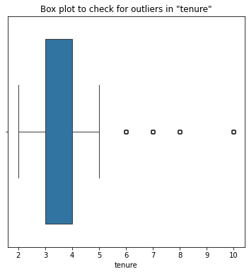
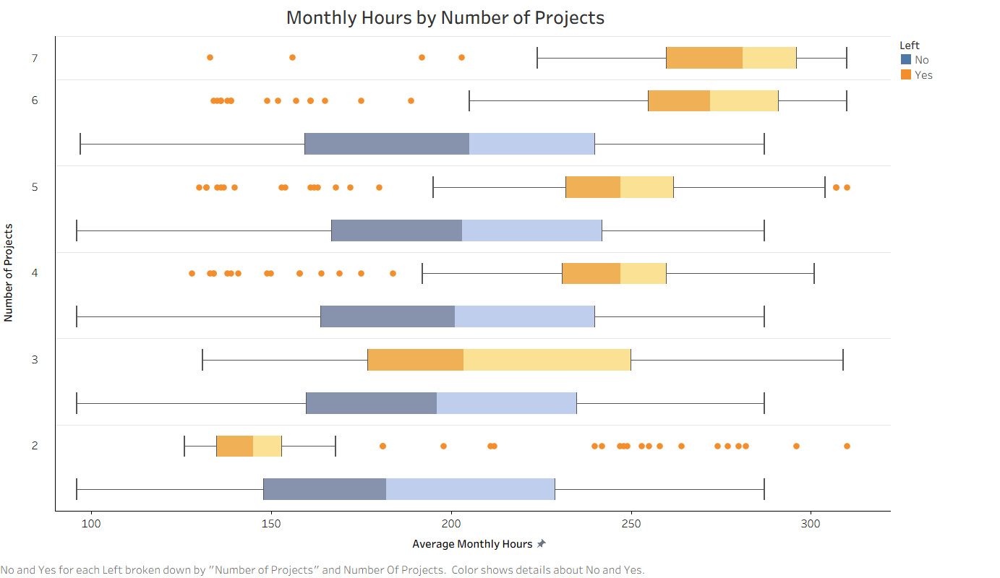
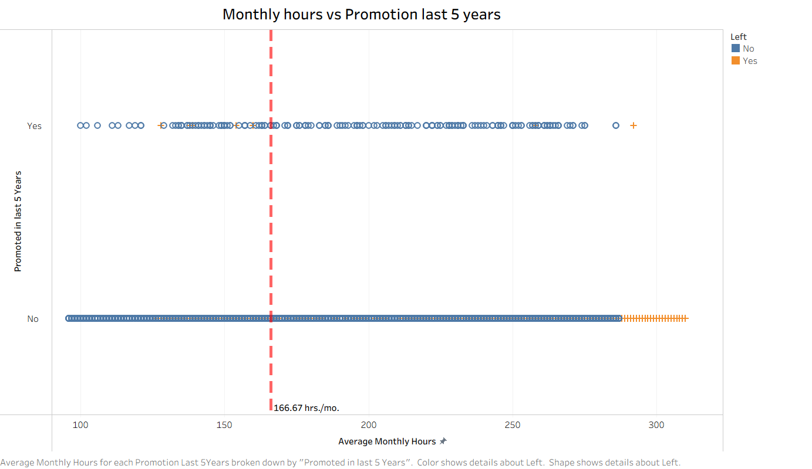
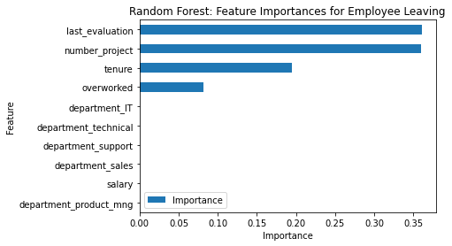
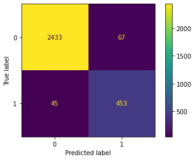
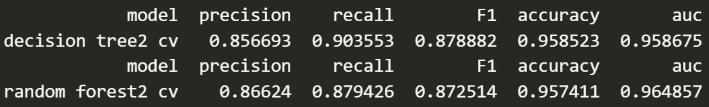

# 🚀 Employee Churn Analysis & Prediction  | Salifort Motors

## 📌 Overview
The goal of this project was to analyze employee survey data and build predictive models to identify employees at risk of leaving the company. Using classification techniques such as Logistic Regression and tree-based models, the final models achieved strong performance (ROC-AUC: 96.5%, Recall: 87.9%), enabling reliable identification of high-risk employees.

Key drivers of attrition included workload imbalance (overwork & underutilization), lack of promotion, and low satisfaction levels, indicating systemic issues in workforce management.

## 🧩 Business Understanding
Salifort Motors is experiencing a high employee turnover rate, leading to increased costs in hiring, training, and productivity loss.

Understanding why employees leave is critical to:

- Reducing operational costs
- Improving employee satisfaction and retention
- Supporting long-term workforce planning

The objective was to predict attrition and uncover actionable drivers to help leadership design better retention strategies.

## 📊 Data Understanding
The dataset consists of employee-level survey and performance data, including:

- Satisfaction level, last evaluation score
- Number of projects, average monthly hours
- Tenure, promotion history
- Department and salary

Initial data validation revealed:

- ~20% duplicate records (removed to prevent bias)
- Presence of outliers in tenure (retained for behavioral analysis)

## 🔍 Exploratory Data Analysis (EDA)
Key patterns identified through Tableau dashboards:

- **Bimodal attrition behavior**\
Employees left due to both burnout (250–300+ hrs/month) and underutilization (low workload)

- **Project allocation imbalance**\
Employees handling 6–7 projects showed high attrition, while 3–4 projects formed a stable zone
- **Promotion as a retention factor**\
Very few promoted employees left; high-performing employees were often not promoted

- **Tenure insights**\
Early exits were linked to dissatisfaction, while employees staying beyond ~6 years rarely left
- **Department impact was minimal**\
Attrition patterns were consistent across departments → indicates systemic issues

## ⚙️ Modeling and Evaluation
### Feature Engineering
Behavioral features were engineered from:

- Workload (projects, working hours)
- Growth (promotion history, tenure)
- Performance (evaluation scores)

### Models Used
- Logistic Regression (baseline)
- Decision Tree
- Random Forest / XGBoost

### Model Performance
- ROC-AUC: 96.5%
- Recall: 87.9%

Tree-based models outperformed logistic regression by capturing non-linear relationships in employee behavior.

## 📈 Key Insights
- Attrition is driven more by work structure than compensation alone
- Overworked high performers are at high risk of leaving
- Lack of promotion creates perceived unfairness
- Employees are not rewarded for long-term loyalty

## ✅ Conclusion

The analysis shows that employee attrition at Salifort Motors is primarily driven by:

- Workload imbalance
- Lack of recognition and growth
- Poor alignment between effort and reward

The predictive model enables:\
👉 Early identification of high-risk employees\
👉 Data-driven intervention strategies\
👉 Improved workforce planning

## 🔮 Future Work
- Incorporate employee feedback or engagement survey text data
- Deploy real-time attrition monitoring dashboards
- Test intervention strategies (e.g., workload balancing, promotion policies)